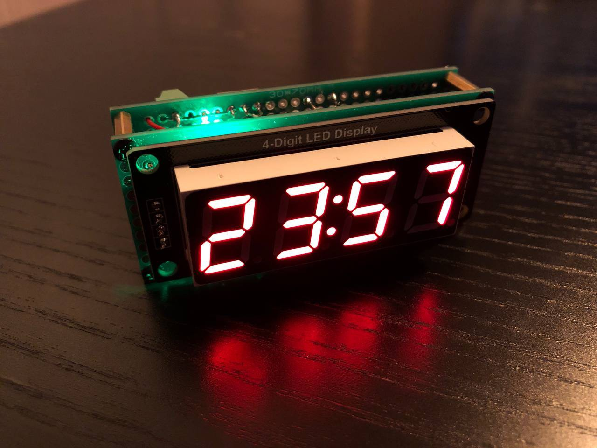
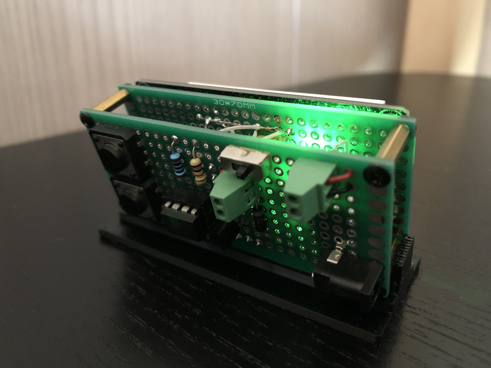
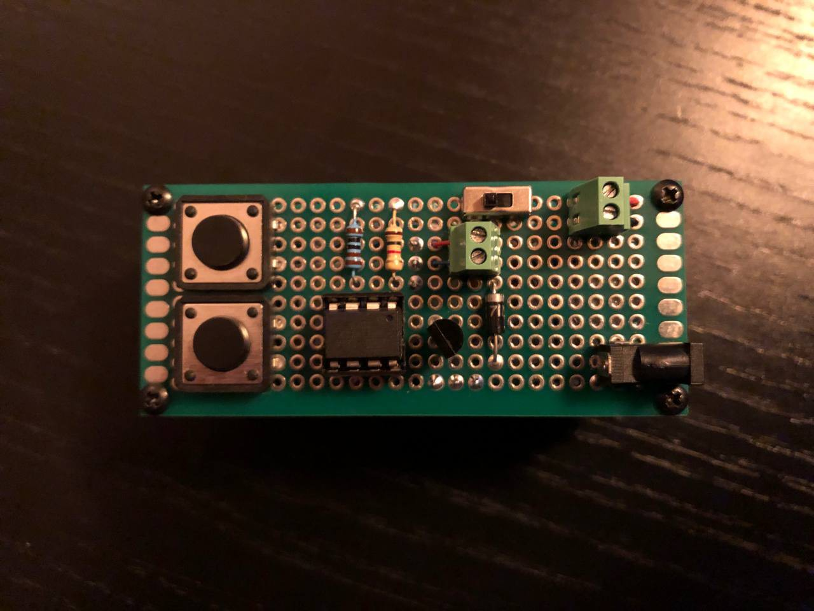
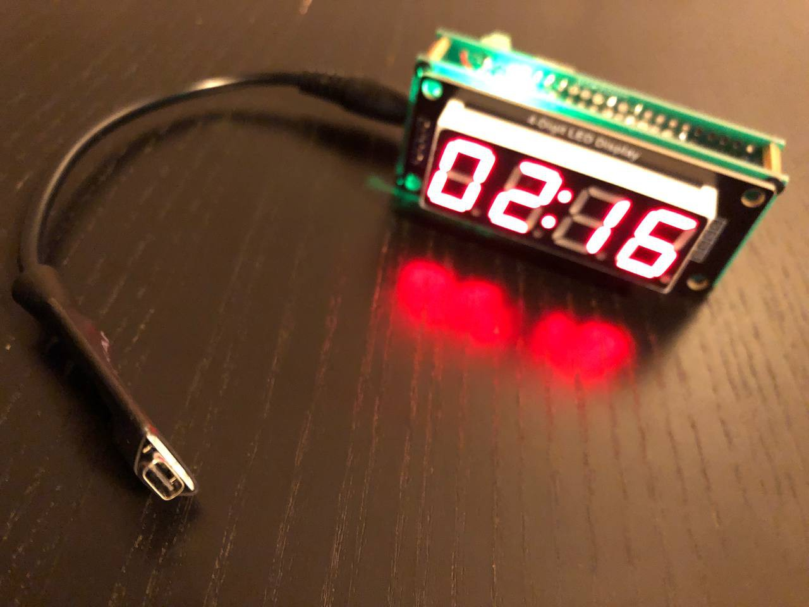

# Hardware Pomodoro Timer

This is a Pomodoro timer with a fixed 25-minute session.

It features two buttons: one for start/pause, and another to display the total time you've been focused since startup.
When the session ends, the device vibrates and blinks so you won't miss the alert.

The code is written in pure assembly language, with no third-party libraries using the old good and simple AVR Studio 4.

It is powered by a 3.7V Li-Po rechargeable battery. To charge it, you will need to build a charging cable using a TP4056 module.

https://github.com/user-attachments/assets/d1ec8b95-45cc-47d5-b04a-e2e02a76e6fc

## Schematic

> You may notice a delay when exiting the total time display mode upon releasing the button. This is because, upon returning from the interrupt handler, we go back to the total time display subroutine. If we happen to land right at the beginning of this subroutine, we won't exit it until the final instruction is executed, causing a noticeable delay. Conversely, if we land right at its end, we will immediately exit the total time display subroutine upon returning from the interrupt.
The solution to this problem is: once we have detected the exit from the total time display mode within the interrupt handler, we can modify the return address to point to the beginning of the `MAIN` subroutine.